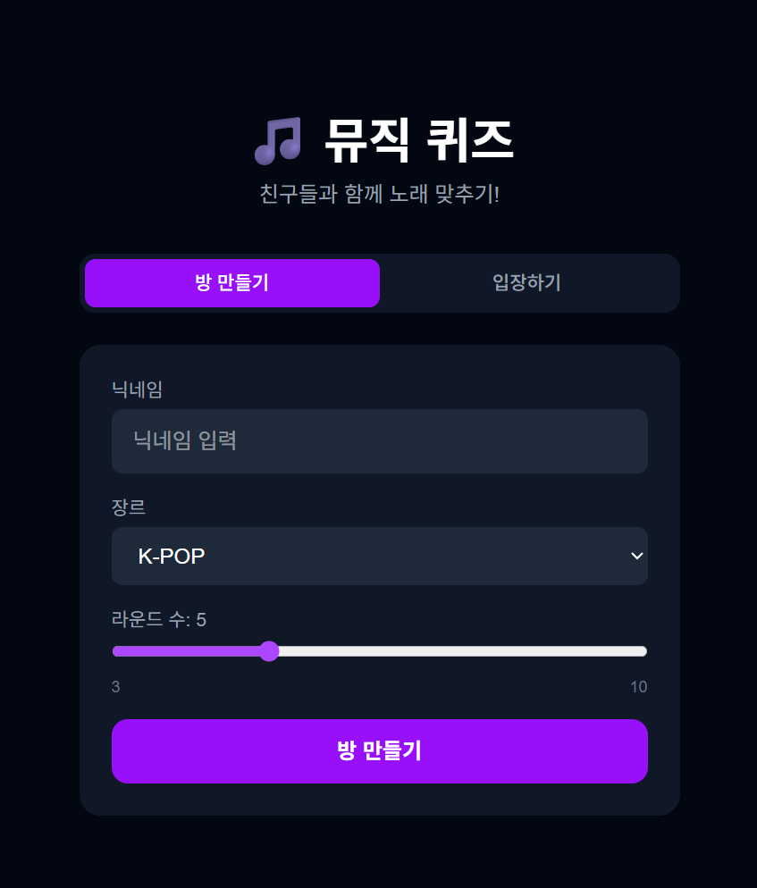
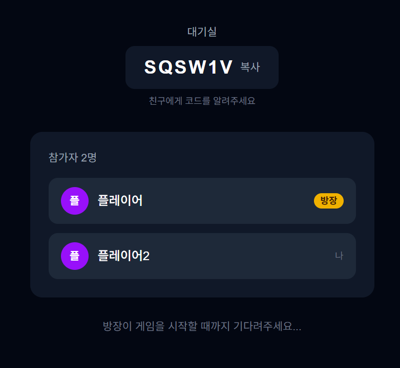
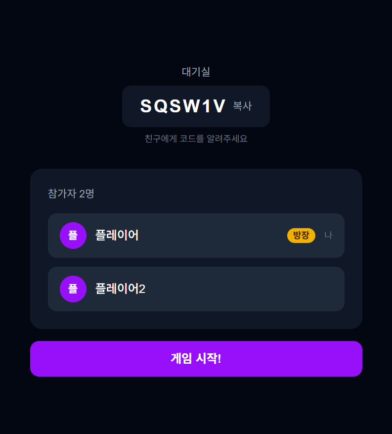
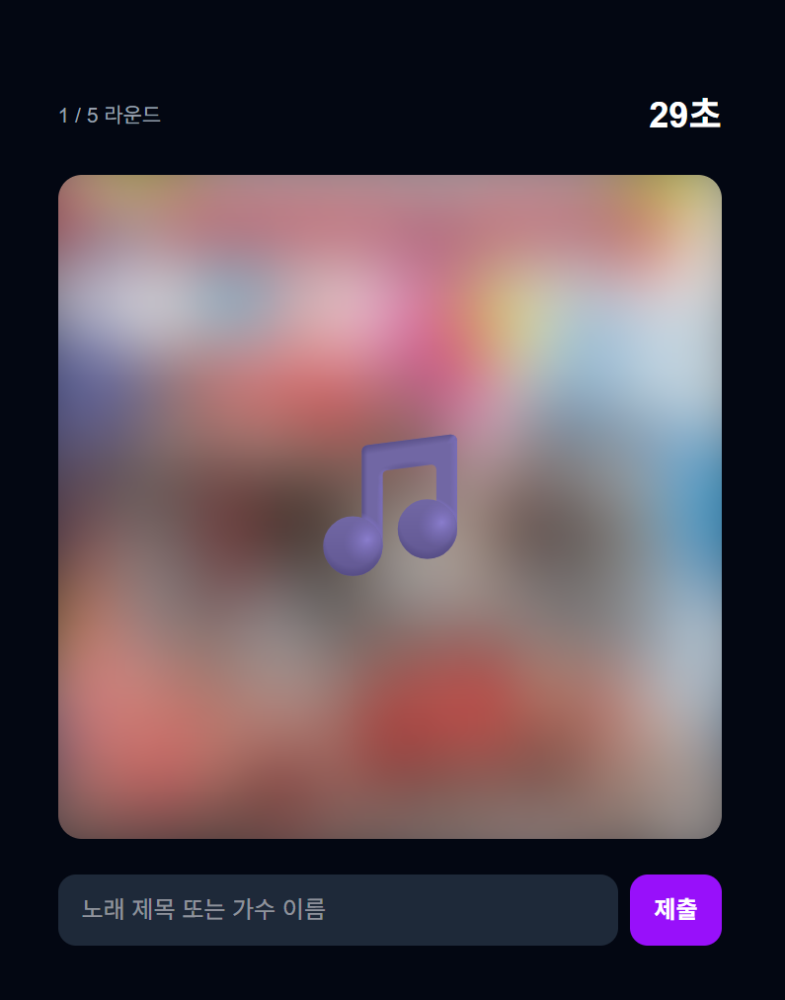
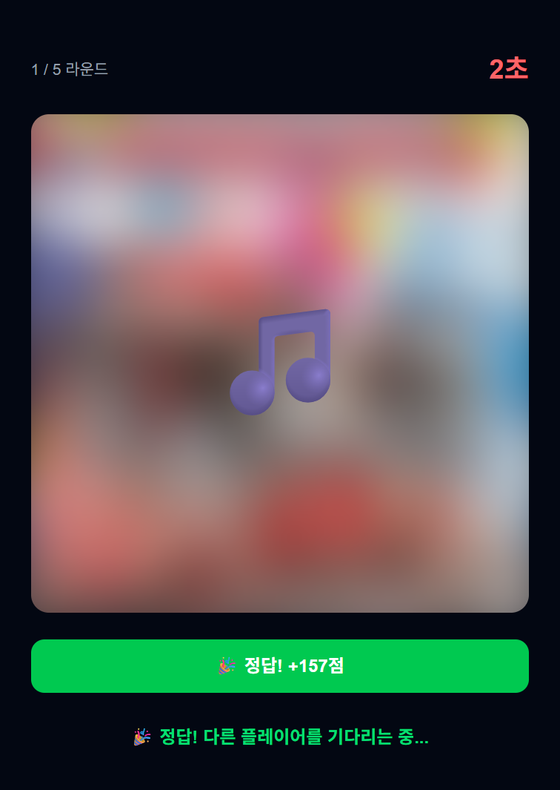
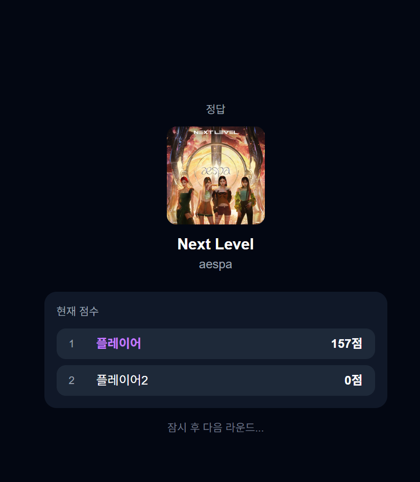
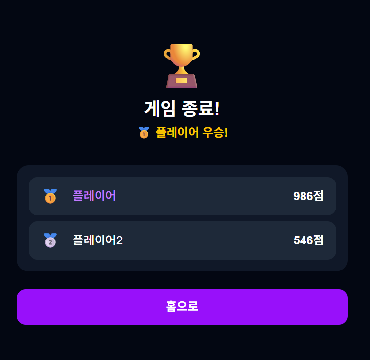

# 🎵 뮤직 퀴즈

친구들과 함께 노래 미리듣기를 듣고 제목/가수를 맞추는 실시간 멀티플레이어 퀴즈 게임


<br/>

## 📸 화면명세서

<table>
  <tr>
    <td align="center"><b>메인 화면</b></td>
    <td align="center"><b>대기실 (참가자)</b></td>
    <td align="center"><b>대기실 (방장)</b></td>
  </tr>
  <tr>
    <td></td>
    <td></td>
    <td></td>
  </tr>
  <tr>
    <td align="center"><b>게임 진행</b></td>
    <td align="center"><b>정답</b></td>
    <td align="center"><b>라운드 결과</b></td>
  </tr>
  <tr>
    <td></td>
    <td></td>
    <td></td>
  </tr>
  <tr>
    <td align="center"><b>최종 결과</b></td>
    <td></td>
    <td></td>
  </tr>
  <tr>
    <td></td>
    <td></td>
    <td></td>
  </tr>
</table>
<br/>

## 📌 주요 기능

- **실시간 멀티플레이어** — WebSocket 기반 실시간 통신으로 여러 명이 동시에 게임 참여
- **6자리 방 코드** — 코드 하나로 친구 초대, 장르/라운드 수 커스터마이징
- **30초 미리듣기** — Deezer API의 미리듣기 URL로 노래 재생
- **한글 정답 지원** — DeepL API + 번역 캐시로 한글로 입력해도 정답 처리
- **시간 기반 점수** — 빠르게 맞출수록 높은 점수 (최대 1000점)
- **feat. 관대한 정답 처리** — 피처링 제거, 아티스트 이름 일부만 써도 정답

<br/>

## 🛠️ 기술 스택

### 프론트엔드

- **Next.js 15** (App Router)
- **TypeScript**
- **Tailwind CSS**
- **Socket.io Client**

### 백엔드

- **Node.js + Express**
- **Socket.io** (WebSocket 실시간 통신)
- **TypeScript**

### 외부 API

- **Deezer API** — 노래 30초 미리듣기 (무료, 인증 불필요)
- **Last.fm API** — 장르별 인기 차트
- **DeepL API** — 한글 정답 처리를 위한 번역

### 배포

- **Vercel** (프론트엔드)
- **Railway** (백엔드)

<br/>

## 🏗️ 아키텍처

```
클라이언트 (Next.js)
    │
    ├── REST API ──────────────► Express 서버 ──► Deezer API
    │                                         └──► Last.fm API
    │                                         └──► DeepL API
    └── WebSocket (Socket.io) ─► Express 서버
                                     │
                                     └── 방 관리 (메모리)
                                          ├── roomHandlers.ts
                                          └── gameHandlers.ts
```

### WebSocket 이벤트 흐름

```
방 생성        room:create  →  room:created (방 코드 + playerId 발급)
방 입장        room:join    →  room:joined  (playerId 발급)
                           →  room:update  (전체 브로드캐스트)
게임 시작      game:start   →  game:started (전체 브로드캐스트)
라운드 시작                 →  round:start  (previewUrl 전송)
정답 제출      answer:submit → answer:correct / answer:wrong
라운드 종료                 →  round:end    (정답 + 점수 공개)
게임 종료                   →  game:end     (최종 순위)
```

<br/>

## 🚀 로컬 실행 방법

### 필요한 것

- Node.js 18 이상
- Last.fm API Key ([발급](https://www.last.fm/api/account/create))
- DeepL API Key ([발급](https://www.deepl.com/pro-api))

### 1. 레포 클론

```bash
git clone https://github.com/유저명/music-quiz.git
cd music-quiz
```

### 2. 프론트엔드 설정

```bash
npm install
```

`.env.local` 파일 생성

```bash
NEXT_PUBLIC_SOCKET_URL=http://127.0.0.1:4000
LASTFM_API_KEY=발급받은키
```

### 3. 백엔드 설정

```bash
cd server
npm install
```

`server/.env` 파일 생성

```bash
CLIENT_URL=http://localhost:3000
LASTFM_API_KEY=발급받은키
DEEPL_API_KEY=발급받은키
```

### 4. 실행

터미널 두 개를 열어서 각각 실행해요.

```bash
# 터미널 1 — 프론트엔드
npm run dev

# 터미널 2 — 백엔드
cd server
npx nodemon --exec "ts-node --project tsconfig.json" index.ts
```

브라우저에서 `http://127.0.0.1:3000` 접속

<br/>

## 📁 프로젝트 구조

```
music-quiz/
├── app/
│   ├── page.tsx              # 홈 화면 (방 만들기 / 입장)
│   ├── room/[code]/
│   │   └── page.tsx          # 대기실
│   ├── game/[code]/
│   │   └── page.tsx          # 게임 화면
│   └── api/
│       └── tracks/
│           └── route.ts      # Deezer 트랙 조회 API
├── lib/
│   └── socket.ts             # 소켓 싱글톤 관리
├── assets/                   # 스크린샷
└── server/
    ├── index.ts              # Express + Socket.io 서버
    ├── rooms.ts              # 방 데이터 구조 및 유틸
    ├── translationCache.ts   # DeepL 번역 캐시
    └── handlers/
        ├── roomHandlers.ts   # 방 생성/입장/퇴장 이벤트
        └── gameHandlers.ts   # 게임 로직 (라운드, 정답, 점수)
```

<br/>

## 💡 트러블슈팅 기록

### Spotify → Deezer API 전환

처음에는 Spotify API로 미리듣기를 구현하려 했으나, Spotify가 최근 정책을 변경해 개발자 계정에 프리미엄 구독을 요구하는 것을 확인했습니다. 동일한 기능을 무료로 제공하는 Deezer API로 전환해 해결했습니다.

### WebSocket 소켓 관리

페이지 이동 시마다 소켓을 새로 생성하면 방 데이터가 초기화되는 문제가 발생했습니다. `lib/socket.ts` 에서 싱글톤 패턴으로 소켓을 전역 관리하고, `playerId` 로 재연결을 구분해 해결했습니다.

### 한글 정답 처리

Deezer에서 가져온 곡명/아티스트가 영어라 한글 입력 시 정답 처리가 안 되는 문제가 있었습니다. DeepL API로 영어 곡명을 한글로 번역해 캐시에 저장하고, 유저 입력과 비교하는 방식으로 해결했습니다. 번역 결과를 JSON 파일로 캐싱해 API 호출 비용을 최소화했습니다.

### React Strict Mode + WebSocket

개발 환경에서 React Strict Mode가 `useEffect` 를 두 번 실행해 소켓 연결이 중복되는 문제가 있었습니다. `next.config.ts` 에서 `reactStrictMode: false` 로 설정해 해결했습니다.

<br/>
